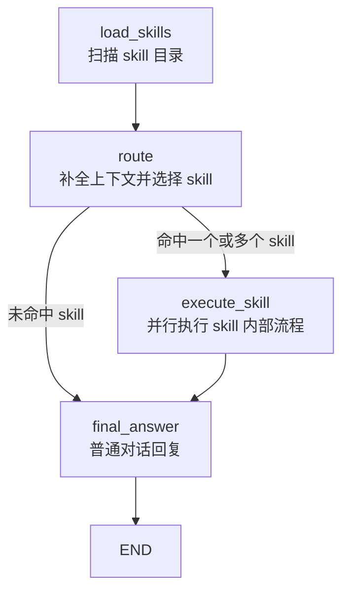
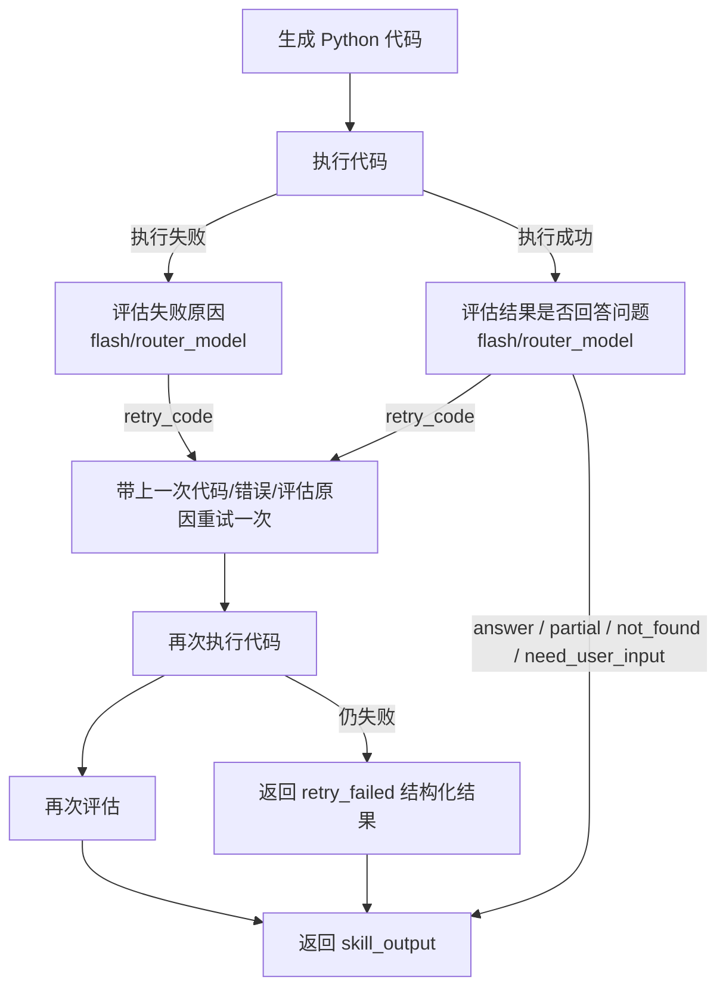
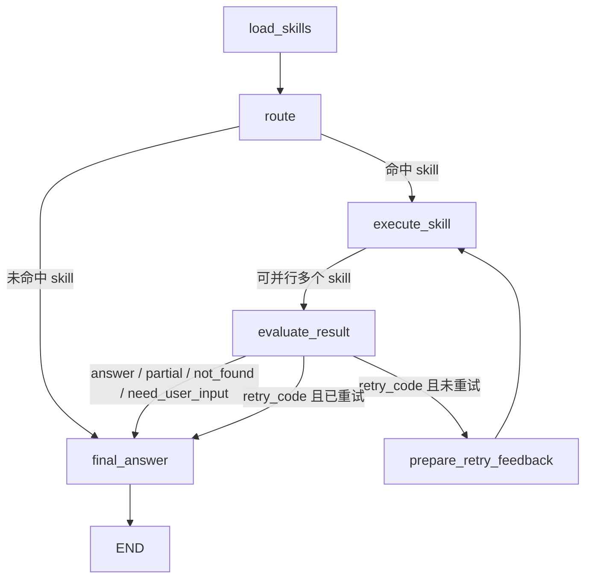

# Agent Flow

当前 LangGraph 的节点级流程：

`execute_skill` 节点会对命中的多个 skill 使用并行执行。每个 skill 的内部流程一致：

当前实现里，评估逻辑还不是独立 LangGraph 节点，而是包在 `execute_skill` 节点内部。这样改动小，但图上看不出“执行 -> 评估 -> 是否回到执行”的显式边。

更理想的 LangGraph 形态可以拆成独立节点：

这个拆法更符合“执行节点后接评估节点，评估节点决定是否拉回执行节点重做”的 mental model，也更方便后续在前端显示当前阶段。
